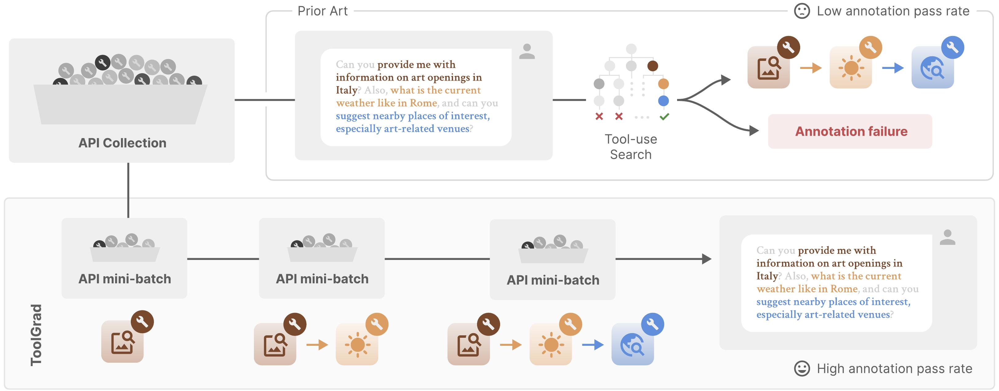
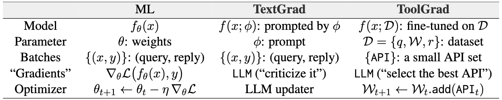

# ToolGrad: Efficient Tool-use Dataset Generation with Textual "Gradients" (ACL 26 Finding)
<!--- BADGES: START --->
[][#license]
[][#arxiv-paper] 
[][#pypi-package] 
<!-- Replace the PyPI badge with ToolGrad later -->
[][#dataset-hf]


<!-- Replace the PyPI link with ToolGrad later -->
[#pypi-package]: https://pypi.org/project/toolgrad
[#license]: LICENSE
[#arxiv-paper]: http://arxiv.org/abs/2508.04086

[#dataset-hf]: https://huggingface.co/datasets/zhongyi-zhou/toolgrad-500
[#model-hf]: https://huggingface.co/models/

<!--- BADGES: END --->

This is an official repo for <ToolGrad: Efficient Tool-use Dataset Generation with Textual “Gradients”>.

<p align="center">
  
</p>

<p align="center">
  
</p>

## BibTex
```bibtex
@misc{zhou2025toolgradefficienttoolusedataset,
      title={ToolGrad: Efficient Tool-use Dataset Generation with Textual "Gradients"}, 
      author={Zhongyi Zhou and Kohei Uehara and Haoyu Zhang and Jingtao Zhou and Lin Gu and Ruofei Du and Zheng Xu and Tatsuya Harada},
      year={2025},
      eprint={2508.04086},
      archivePrefix={arXiv},
      primaryClass={cs.CL},
      url={https://arxiv.org/abs/2508.04086}, 
}
```